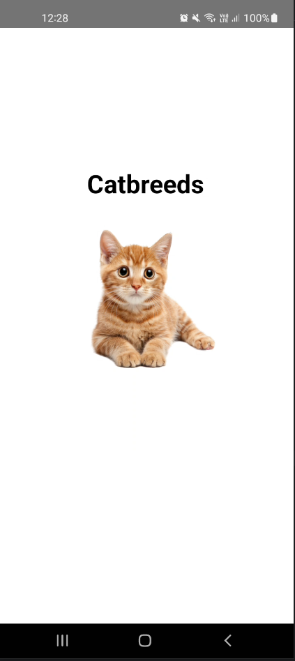
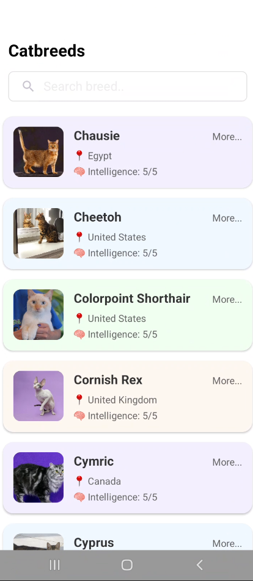
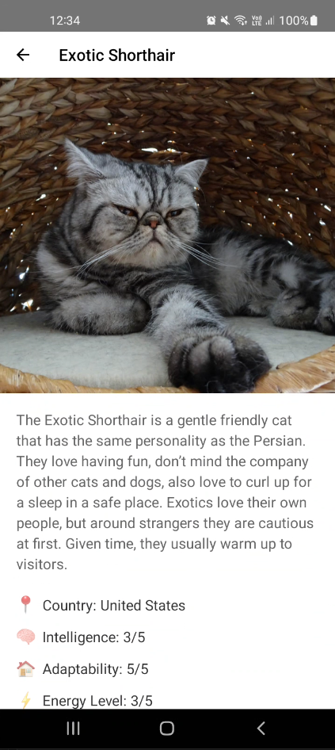

# 🐱 Cat Breeds App

Una aplicación Android nativa que permite explorar diferentes razas de gatos, con información detallada sobre cada una de ellas.

## 📱 Características

- **Pantalla de inicio (Splash)**: Presentación de la aplicación con carga inicial
- **Lista de razas**: Navegación por diferentes razas de gatos con búsqueda en tiempo real
- **Vista detallada**: Información completa de cada raza incluyendo características, temperamento y fotos
- **Búsqueda**: Filtrado de razas por nombre en tiempo real
- **Carga de imágenes**: Visualización de fotos de alta calidad de cada raza

## 🏗️ Arquitectura y Organización

### Estructura del Proyecto

```
app/src/main/java/com/example/myapplication/
├── adapters/           # Adaptadores para RecyclerView
│   └── CatBreedsAdapter.java
├── api/               # Servicios de API y networking
│   └── CatApiService.java
├── models/            # Modelos de datos (POJOs)
│   ├── CatBreed.java
│   ├── Image.java
│   └── Weight.java
├── DetailActivity.java     # Pantalla de detalle de raza
├── MainActivity.java       # Pantalla principal con lista
└── SplashActivity.java    # Pantalla de carga inicial
```

### Patrón de Arquitectura

- **Modelo-Vista**: Separación clara entre datos (models) y presentación (activities)
- **Repository Pattern**: Uso de interfaces para servicios de API
- **Adapter Pattern**: Para manejo de listas con RecyclerView

## 🛠️ Tecnologías y Librerías

### Networking y Datos
- **[Retrofit 2.9.0](https://square.github.io/retrofit/)**: Cliente HTTP type-safe para Android
- **[Gson 2.10.1](https://github.com/google/gson)**: Serialización/deserialización JSON
- **[OkHttp 4.12.0](https://square.github.io/okhttp/)**: Cliente HTTP con interceptors de logging

### UI y Experiencia de Usuario
- **[Material Design Components](https://material.io/develop/android)**: Componentes de diseño Material
- **[RecyclerView 1.3.2](https://developer.android.com/jetpack/androidx/releases/recyclerview)**: Listas eficientes y reutilizables
- **[CardView 1.0.0](https://developer.android.com/jetpack/androidx/releases/cardview)**: Tarjetas con Material Design
- **[ConstraintLayout](https://developer.android.com/training/constraint-layout)**: Layouts flexibles y responsivos

### Carga de Imágenes
- **[Picasso 2.8](https://square.github.io/picasso/)**: Carga, transformación y cache de imágenes

### API Externa
- **[The Cat API](https://thecatapi.com/)**: Fuente de datos sobre razas de gatos

## 🚀 Configuración del Proyecto

### Requisitos
- **Android Studio Arctic Fox** o superior
- **API Level mínimo**: 24 (Android 7.0)
- **API Level objetivo**: 36 (Android 14)
- **Java 11**

### Instalación

1. Clona el repositorio:
   ```bash
   git clone [URL_DEL_REPOSITORIO]
   ```

2. Abre el proyecto en Android Studio

3. Sincroniza las dependencias:
   ```bash
   ./gradlew build
   ```

4. Ejecuta la aplicación en un dispositivo o emulador

### Permisos Requeridos
```xml
<uses-permission android:name="android.permission.INTERNET" />
```

## 📋 Funcionalidades Principales

### 1. Splash Screen
- Pantalla de bienvenida con duración de 3 segundos
- Transición automática a la pantalla principal
- Sin ActionBar para experiencia inmersiva

### 2. Lista de Razas (MainActivity)
- Carga de 20 razas desde The Cat API
- RecyclerView con scroll infinito
- Búsqueda en tiempo real por nombre
- Estados de UI: carga, contenido, vacío, error
- Navegación a vista detallada por tap

### 3. Vista Detallada (DetailActivity)
- Información completa de la raza seleccionada
- Imagen de alta resolución
- Características: inteligencia, adaptabilidad, nivel de energía
- Información adicional: origen, temperamento, esperanza de vida
- Navegación de regreso con botón en toolbar

## 📸 Capturas de Pantalla

### Splash Screen


### Pantalla Principal (Home)


### Vista de Detalle


## 🎨 Diseño y UX

### Características de Diseño
- **Material Design**: Siguiendo las guías de diseño de Google
- **Colores dinámicos**: Diferentes colores de fondo para cada tarjeta
- **Imágenes responsivas**: Carga optimizada con placeholders y fallbacks
- **Navegación intuitiva**: Transiciones fluidas entre pantallas
- **Búsqueda en tiempo real**: Filtrado instantáneo sin necesidad de botón de búsqueda

### Estados de la Aplicación
- **Carga**: ProgressBar durante peticiones de API
- **Contenido**: Lista de razas con información
- **Vacío**: Mensaje cuando no hay resultados de búsqueda
- **Error**: Manejo de errores de conexión con mensajes informativos

## 🧪 Testing

### Testing Unitario
```bash
./gradlew test
```

### Testing de Instrumentación
```bash
./gradlew connectedAndroidTest
```

## 📈 Posibles Mejoras Futuras

- [ ] Implementar paginación para cargar más razas
- [ ] Agregar favoritos con almacenamiento local
- [ ] Implementar modo offline con Room Database
- [ ] Añadir filtros avanzados (por origen, características)
- [ ] Integrar compartir información de razas
- [ ] Implementar modo oscuro
- [ ] Agregar animaciones personalizadas
- [ ] Incluir sonidos de gatos

## 🤝 Contribución

Las contribuciones son bienvenidas. Para contribuir:

1. Fork el proyecto
2. Crea una rama para tu feature (`git checkout -b feature/AmazingFeature`)
3. Commit tus cambios (`git commit -m 'Add some AmazingFeature'`)
4. Push a la rama (`git push origin feature/AmazingFeature`)
5. Abre un Pull Request

## 📄 Licencia

Este proyecto está bajo la Licencia MIT. Ver el archivo `LICENSE` para más detalles.

## 📞 Contacto

- **Desarrollador**: [Tu Nombre]
- **Email**: [tu.email@ejemplo.com]
- **Proyecto**: [Link al repositorio]

---

⭐ Si te gusta este proyecto, ¡dale una estrella en GitHub! 